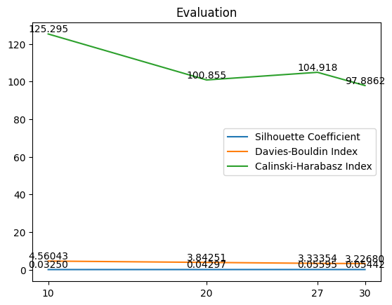

# Abstract Model

### Internal Evaluation

|   | Model  | Silhouette Coefficient | Davies-Bouldin Index | Calinski-Harabasz Index |
| --- | -------- | ------------------------ | ---------------------- | ------------------------- |
| 0 | lda_10 | 0.032503               | 4.560431             | 125.295974              |
| 1 | lda_20 | 0.042975               | 3.842511             | 100.855155              |
| 2 | lda_27 | 0.055959               | 3.333544             | 104.918157              |
| 3 | lda_30 | 0.054428               | 3.226808             | 97.886297               |

The best model for abstract is lda_10.

