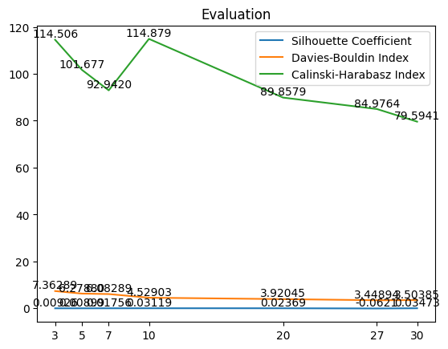

# README Model

### Internal Evaluation

|   | Model  | Silhouette Coefficient | Davies-Bouldin Index | Calinski-Harabasz Index |
| --- | -------- | ------------------------ | ---------------------- | ------------------------- |
| 0 | lda_3  | 0.009265               | 7.362897             | 114.506023              |
| 1 | lda_5  | 0.008996               | 6.278808             | 101.677888              |
| 2 | lda_7  | 0.017564               | 6.082893             | 92.942044               |
| 3 | lda_10 | 0.031191               | 4.529037             | 114.879504              |
| 4 | lda_20 | 0.023700               | 3.920453             | 89.857928               |
| 5 | lda_27 | -0.062191              | 3.448946             | 84.976428               |
| 6 | lda_30 | 0.034733               | 3.503857             | 79.594159               |

The best model for abstract is lda_10.

